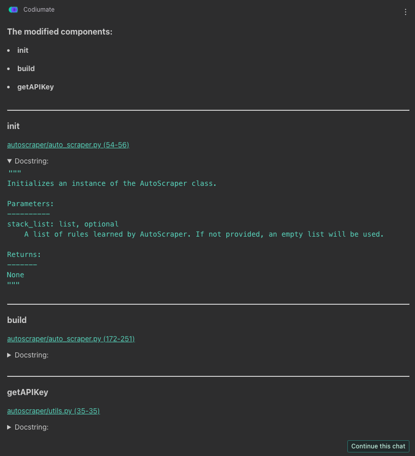

# `/docstring`

##Description
Automatically generate or improve docstrings for your code, enhancing documentation quality and maintainability. The `/docstring` command is designed to aid in creating comprehensive, clear, and consistent docstrings for functions, classes, and modules, following best documentation practices.

##How to Use
To use the `/docstring` command, follow these steps:

1. **Select Your Mode**: Choose the appropriate context for adding or improving docstrings. Codiumate supports this command in two modes:
    - **File Mode**: For generating or refining docstrings within a specific file, focusing on individual functions, classes, or entire files.
    - **Workspace Mode**: For a broader approach, encompassing multiple files within your workspace to ensure consistent documentation across your project.

2. **Select Your Focus**: Identify the code segment or entire file for which you wish to generate or enhance the docstring. 

3. **Initiate the Command**: Type `/docstring` followed by an optional specific instruction or leave it blank for general docstring generation. Codiumate will analyze the selected code and generate a suitable docstring or suggest improvements to existing documentation.

4. **Review and Apply**: Evaluate the suggested docstring provided by Codiumate. You can directly apply the changes with a single click or edit the suggestion to better fit your requirements before applying.

!!! success "Available in"
    - [:fontawesome-solid-file-lines: File Mode](../focus/current-file.md)
    - [:fontawesome-solid-folder-tree: Workspace Mode](../focus/git-diff.md)

!!! threads "Threads"
    This command supports threading. [Read more about Threads](../threads.md).

!!! example "Docsctring for component (File Mode)"
    ### Commands:
    `/docstring`

    ---
    ### Response:

    {loading=lazy}

!!! example "Docstring for Changeset (Workspace Mode)"
    ### Commands:
    `/docstring enhance readability`

    --- 
    ### Response:
    {loading=lazy}