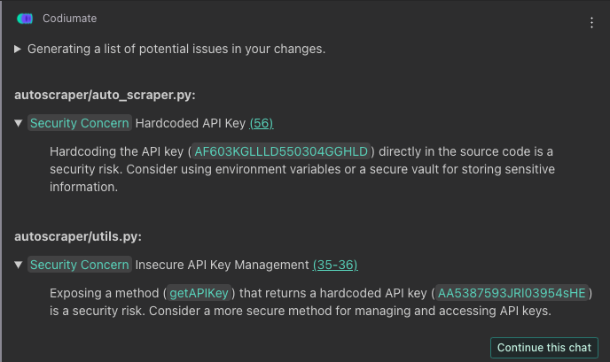

# `/issues`

<h2>Description</h2>
The `/issues` command in Codiumate is engineered to enhance code quality and security by identifying potential issues within your codebase. Available in both Workspace Mode and File Changes Mode, this command scrutinizes your code for a variety of issues, such as security vulnerabilities, logical errors, debugging remnants, and more. Each identified issue is accompanied by a tag indicating its type, a direct link to the implicated code, and a detailed description of the problem. This feature is essential for preemptively addressing problems that could compromise your project's integrity or performance.

<h2>How to Use</h2>
Follow these steps to efficiently utilize the `/issues` command:

1. **Select Your Changeset**: Identify the scope by selecting file, local, staged, or committed changes. 

2. **Select Target Branch (for committed changes)**: If your focus is on committed changes, you must select the target branch to which your current working branch will be compared. For local or staged changes, proceed directly to initiating the command as these do not require a target branch selection.

2. **Initiate the Command**: Type `/issues` in the chat interface. Codiumate then proceeds to analyze the selected scope—either the entire changeset (loca, stages or committed changes) or the specified changes in a file—for potential issues.

3. **Review Identified Issues**: Codiumate presents a list of found issues, each tagged with its type (e.g., Security Concern, Potential Issue, Leftover Debugging Code, Misspelled Variable). Alongside each issue is a link to the relevant code and a comprehensive description of the problem, enabling you to quickly grasp and locate the concern.

4. **Start a Thread for Fixes**: If you wish to receive suggestions for fixing the identified issues, you can initiate a [thread](../threads.md) directly from the issues list. In this interactive discussion, ask Codiumate for specific advice on how to address each concern. Codiumate will provide tailored suggestions for resolving the problems, enhancing the security and quality of your code.

!!! success "Available in"
    - [Workspace Mode](../modes/workspace-mode.md)
    - [File Changes Mode](../modes/file-mode.md#file-changes)

!!! threads "Threads"
    This command supports threading. [Read more about Threads](../threads.md).

!!! example
    ### Command: 
    `/issues`

    ---
    ### Response: 

    
    